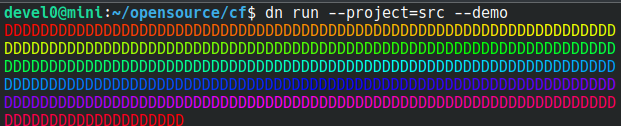

# colorful



## Introduction

Purpose of this app is to allow an easy way to colorize logs,
a set of rules can be specified to match within regex and place color against these matches.

Typical usage:

```sh
journalctl -f | cf
```

this will color the log for things we configured in the default `~/.config/cf/default.json` config file or with one supplied at cmdline.

```sh
tail -f /app/var/log/dev.log | cf ~/.config/cf/php.json
```

## build from source

```sh
apt install dotnet8

git clone https://github.com/devel0/cf

cd cf
dotnet publish
```

then copy produced build single file

`./src/bin/Release/net8.0/linux-x64/publish/cf`

to some in path

`/usr/local/bin`

## synopsis

```sh
cf [--test=FG[,BG]] [--file=INPUTFILE] <config-file>

Options:
    --test=[FG[,BG]]     prints out a sample with given hex color.
    --demo               print color demo
    --file=INPUTFILE     read from given input file instead of stdin

Default config file is /home/devel0/.config/cf/default.json
```

## default config

```json
[
  {
    "Note": "pid",
    "Foreground": "317444",
    "Background": "",
    "Regex": [ "[a-z0-9]+\\[(\\d*)\\]" ],
    "GroupMatch": true,
    "IgnoreCase": false,
    "FullRow": false
  },
  {
    "Note": "procname",
    "Foreground": "d8e21d",
    "Background": "",
    "Regex": [ "[a-z0-9]+\\s([^\\s]*)\\[\\d*\\]" ],
    "GroupMatch": true,
    "IgnoreCase": false,
    "FullRow": false
  }
]
```

result example


## example explained


- `fullrow` matches all the row setting black background
- `hours and service` matches dd:dd:dd or xxx.service setting foreground and background
- `pattern1` matches `deactivated successfully` case-insensitive setting foreground
- `pattern2` matches `success` case-insensitive settings foreground
- `pid` matches the number inside square bracket with a regex containing a group thus using GroupMatch mode

```json
[
  {
    "Note": "fullrow",
    "Foreground": "",
    "Background": "#000000",
    "Regex": [ ".*" ],
    "FullRow": true
  },
  {
    "Note": "hours and service",
    "Foreground": "#42ff81",
    "Background": "#06160b",
    "Regex": [ "\\d\\d:\\d\\d:\\d\\d", "[^\\s]*\\.service" ]
  },
  {
    "Note": "pattern1",
    "Foreground": "#bc4bc6",
    "Regex": [ "deactivated successfully" ],
    "IgnoreCase": true
  },
  {
    "Note": "pattern2",
    "Foreground": "#f260ff",
    "Regex": [ "success" ],
    "IgnoreCase": true
  },
  {
    "Note": "pid",
    "Foreground": "#202020",
    "Background": "#ffff00",
    "Regex": [ "\\[(\\d+)]" ],
    "GroupMatch": true,
    "IgnoreCase": true
  }
]
```

## configuration

in the config json an array of these objects can be specified

| field        | description                                                                                              |
| ------------ | -------------------------------------------------------------------------------------------------------- |
| `Note`       | free text to annotate the rule purpose                                                                   |
| `Regex`      | c# regex                                                                                                 |
| `Foreground` | hex color for matching text ( empty string to unchange )                                                 |
| `Background` | hex color for matching text ( empty string to unchange )                                                 |
| `GroupMatch` | if true any out of the first group match will not considered as a match. See default config for a sample |
| `IgnoreCase` | if `true` regex search will case insensitive                                                             |
| `FullRow`    | if `true` first rule matching will colorize entire matchin row                                           |

Notes:
- subsequent matches can override colors; if a rule matches it can override foreground or background or both depending on what rule set in config.

## exitcodes

| code | descr                                                 |
| ---- | ----------------------------------------------------- |
| 0    | ok                                                    |
| 1    | config file not specified and default not found       |
| 2    | config file specified not found                       |
| 3    | unable to parse config file                           |
| 4    | input file specified with `--input=` option not found |
| 10   | `--test` option used                                  |
| 100  | ctrl+c                                                |
