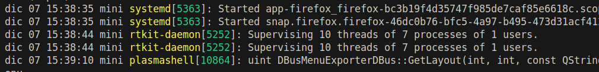

# colorful

## Introduction

Purpose of this app is to allow an easy way to colorize logs,
a set of rules can be specified to match within regex and place color against these matches.

Typical usage:

```sh
journalctl -f | cf
```

this will color the log for things we configured in the default `~/.config/cf/default.json` config file or with one supplied at cmdline.

```sh
tail -f /app/var/log/dev.log | cf ~/.config/cf/php.json
```

## build from source

```sh
apt install dotnet8

git clone https://github.com/devel0/cf

cd cf
dotnet publish
```

then copy produced build single file

`./bin/Release/net8.0/linux-x64/publish/cf`

to some in path

`/usr/local/bin`

## synopsis

```sh
cf [--test=HEXCOLOR] <config-file>

Options:
    --test=HEXCOLOR     prints out a sample with given hex color.

Default config file is /home/devel0/.config/cf/default.json
```

## default config

```json
[
  {
    "Note": "pid",
    "Foreground": "317444",
    "Background": "",
    "Regex": "[a-z0-9]+\\[(\\d*)\\]",
    "GroupMatch": true,
    "IgnoreCase": false,
    "FullRow": false
  },
  {
    "Note": "procname",
    "Foreground": "d8e21d",
    "Background": "",
    "Regex": "[a-z0-9]+\\s([^\\s]*)\\[\\d*\\]",
    "GroupMatch": true,
    "IgnoreCase": false,
    "FullRow": false
  }
]
```

result example



## configuration

in the config json an array of these objects can be specified

| field        | description                                                                                              |
| ------------ | -------------------------------------------------------------------------------------------------------- |
| `Note`       | free text to annotate the rule purpose                                                                   |
| `Regex`      | c# regex                                                                                                 |
| `Foreground` | hex color for matching text ( empty string to unchange )                                                 |
| `Background` | hex color for matching text ( empty string to unchange )                                                 |
| `GroupMatch` | if true any out of the first group match will not considered as a match. See default config for a sample |
| `IgnoreCase` | if `true` regex search will case insensitive                                                             |
| `FullRow`    | if `true` first rule matching will colorize entire matchin row                                           |

Notes:
- if two matches in a single row overlaps then the one that match text away from the begin will discarded

## exitcodes

| code | descr                                           |
| ---- | ----------------------------------------------- |
| 0    | ok                                              |
| 1    | config file not specified and default not found |
| 2    | config file specified not found                 |
| 3    | unable to parse config file                     |
| 10   | `--test` option used                            |
| 100  | ctrl+c                                          |
